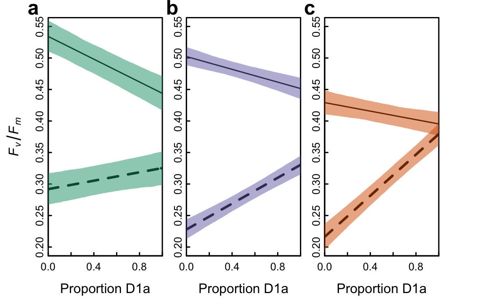
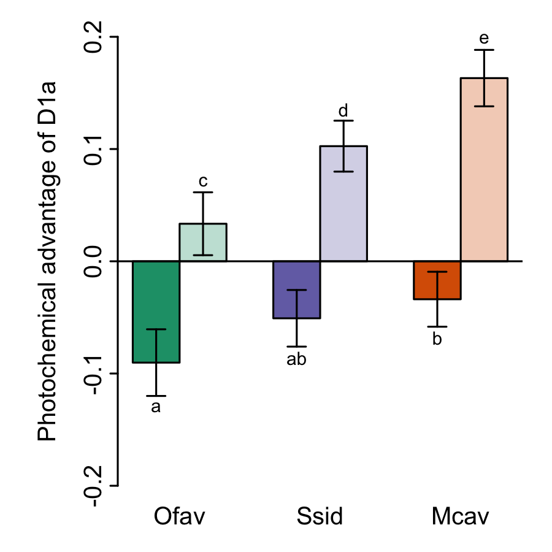
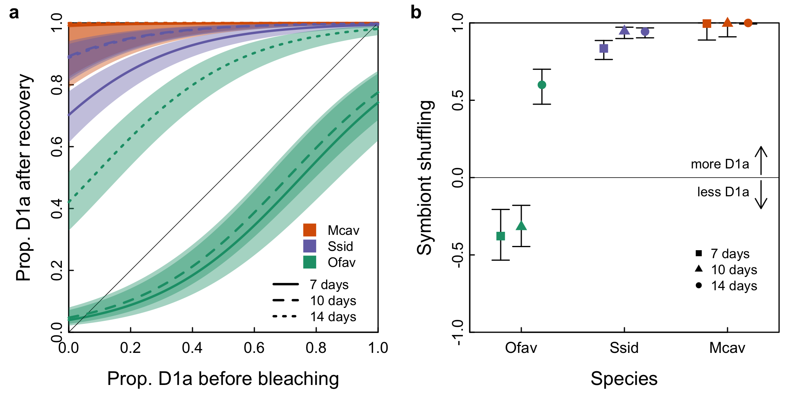
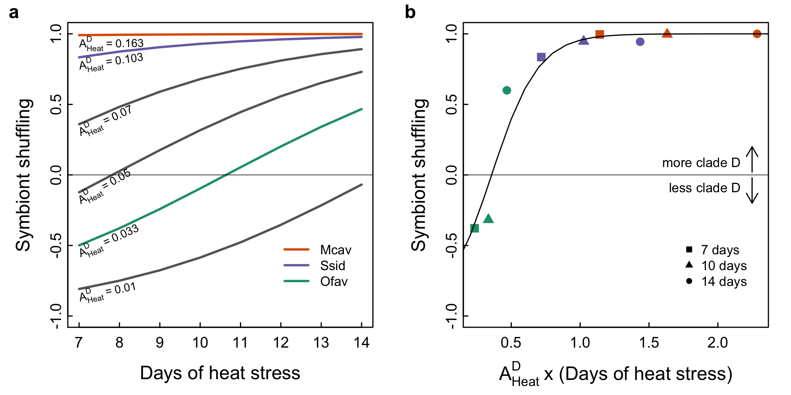

```{r setup, include=FALSE}
# Load libraries
library(MASS)
library(effects)
library(reshape2)
library(scales)
library(lme4)
library(lmerTest)
library(lsmeans)
library(lattice)
library(dplyr)

# Set knit options
knitr::opts_chunk$set(warning=F, message=F, fig.height=5, fig.width=5)
knitr::opts_knit$set(root.dir = "..")

# Polygon drawing function
addpoly <- function(x, y1, y2, col=alpha("lightgrey", 0.8), ...){
  ii <- order(x)
  y1 <- y1[ii]
  y2 <- y2[ii]
  x <- x[ii]
  polygon(c(x, rev(x)), c(y1, rev(y2)), col=col, border=NA, ...)
}
```

# Import data
```{r load_data}
alldata <- read.csv("data/master.csv")
alldata <- alldata[-360, ]  # Remove duplicate Mc9_2 entry with incorrect Fv/Fm recov2 value
alldata$Species <- factor(alldata$Species, levels=c("Of", "Ss", "Mc"))
```

# Analyze Fv/Fm using the repeat bleaching data for *M. cavernosa*
```{r}

# Get data frame with all Ofav and Ssid data
SsOf <- subset(alldata, Species!="Mc")

# Get data frame with Mcav repeat bleaching data (=second bleaching)
Mc <- subset(alldata, BleachLvl2=="Heat" & Species=="Mc")
## Re-level Mcav data for merging with Ofav and Ssid data
## Set data after recovery from first bleaching to the "initial" factor levels
Mc$PropD.init <- Mc$PropD.recov  
Mc$MaxY.init <- Mc$MaxY.recov
## Set data after the second bleaching to the "bleached" factor levels
Mc$BleachLvl <- as.character(Mc$BleachLvl2)
Mc$PropD.bleach <- Mc$PropD.bleach2
Mc$MaxY.bleach <- Mc$MaxY.bleach2
## Set BleachLvl to "Med" to match Ofav and Ssid factor level
Mc$BleachLvl[Mc$BleachLvl=="Heat"] <- "Med"
## Set data after second recovery to the "recove#d95f02" factor levels
Mc$PropD.recov <- Mc$PropD.recov2
Mc$MaxY.recov <- Mc$MaxY.recov2

# Merge data from all three coral species together
bleach3c <- rbind(SsOf, Mc)[, c("Species", "Colony", "Core", "Total.init", "PropD.init", "MaxY.init", "BleachLvl", "Total.bleach", "PropD.bleach", "MaxY.bleach")]
bleach3c <- droplevels(bleach3c)
```

### Initial Fv/Fm before stress
```{r MaxY.init.3c, fig.width=7, fig.height=4}

# Plot Fv/Fm vs. PropD by Species
xyplot(MaxY.init ~ PropD.init | Species, bleach3c, 
       main="Initial Fv/Fm by species",
       xlab="Initial proportion clade D", ylab="Initial Fv/Fm")  

# Fit mixed model with fixed effects of Species and proportion clade D
maxyinit.m <- lmer(MaxY.init ~ PropD.init * Species + (1|Colony),
                   data=bleach3c) 
anova(maxyinit.m)  # Assess significance of Species

# Calculate mean Fv/Fm for each species at PropD=0 w/ pairwise comparisons
maxyinit.lsm <- lsmeans(maxyinit.m, "Species", 
                        at=list(PropD.init=0))  
cld(maxyinit.lsm) # View lsmean comparisons
plot(maxyinit.lsm, main="Initial Fv/Fm with no clade D", horizontal=F)

# Effect of proportion clade D on initial Fv/Fm
maxyinit.m.lst <- lstrends(maxyinit.m, specs="Species", var="PropD.init")
cld(maxyinit.m.lst) # Slopes of fit for each species
plot(Effect(c("PropD.init", "Species"), maxyinit.m))  # Plot model fit

# Difference in Fv/Fm with 100% clade D?
maxyinit.lsm <- lsmeans(maxyinit.m, "Species", at=list(PropD.init=1))
cld(maxyinit.lsm)
plot(maxyinit.lsm, main="Initial Fv/Fm with 100% clade D", horizontal=F)
```

* Higher amounts of clade D #d95f02uce Fv/Fm, with this effect being stronger in *O. faveolata* compa#d95f02 to *S. siderea* and *M. cavernosa*. Fv/Fm with 100% D is lower in *M. cavernosa* than the other two species.

```{r MaxY.bleach.3c, fig.width=7, fig.height=4}

# Fit mixed model with fixed effects of Species and proportion clade D and duration
maxybleach.m <- lmer(MaxY.bleach ~ PropD.bleach * Species * BleachLvl + (1|Colony),
                     data=bleach3c)
select <- lmerTest::step(maxybleach.m)$model
maxybleach.m <- lmer(formula(select), data=bleach3c)
anova(maxybleach.m)

# Calculate mean Fv/Fm for each species at PropD=0 and BleachLvl=Med
maxybleach.0.lsm <- lsmeans(maxybleach.m, "Species", 
                          at=list(PropD.bleach=0, BleachLvl="Med"))  
cld(maxybleach.0.lsm) # View lsmean comparisons
plot(maxybleach.0.lsm, main="Bleached Fv/Fm with 0% clade D", horizontal=F)
maxybleach.0.summ <- summary(maxybleach.0.lsm)

# look at slopes and 100% clade D Fv/Fm
maxybleach.1.lsm <- lsmeans(maxybleach.m, "Species", 
                          at=list(PropD.bleach=1, BleachLvl="Med"))  
cld(maxybleach.1.lsm) # View lsmean comparisons
plot(maxybleach.1.lsm, main="Bleached Fv/Fm with 100% clade D", horizontal=F)
maxybleach.1.summ <- summary(maxybleach.1.lsm)

# Test differences in slopes
maxybleach.lst <- lstrends(maxybleach.m, specs="Species", var="PropD.bleach")
cld(maxybleach.lst) # Slopes of fit for each species
#plot(Effect(c("PropD.bleach", "Species"), maxybleach.m))  # Plot model fit
```  

* With no clade D, *O. faveolata* maintained significantly higher Fv/Fm (`r maxybleach.0.summ$lsmean[1]`±`r maxybleach.0.summ$SE[1]`) than *S. siderea*, while *M. cavernosa* was also lower but not significantly different.
* *O. faveolata* and *S. siderea* with 100% clade D had the same Fv/Fm (0.31) under heat stress, while *M. cavernosa* with clade D had a significantly higher Fv/Fm (0.38). 
* As the proportion of clade D went down, Fv/Fm went down > 3 times faster in *S. siderea* and almost 5 times faster in *M. cavernosa* compa#d95f02 to *O. faveolata*, suggesting their other symbionts differ in thermal sensitivity.


```{r, eval=T}
# Melt data frame so that "time" (i.e., initial vs. bleached) can be used as factor
bleachmelt <- melt(bleach3c, id.vars = c("Species", "Colony", "Core", "BleachLvl"))
bleachmelt <- cbind(bleachmelt, 
                    colsplit(bleachmelt$variable, pattern="\\.", 
                             names=c("resp", "time")))
bleachdat <- dcast(bleachmelt, 
                   formula = Species + Colony + Core + BleachLvl + time ~ resp, value.var="value")
bleachdat$time <- factor(bleachdat$time)

# Test of slopes of FvFm ~ PropD are different for different BleachLvls
testmod <- lmer(MaxY ~ PropD * Species * BleachLvl + (1|Colony), 
                data=subset(bleachdat, time=="bleach" & Species!="Mc"))
anova(testmod)
plot(Effect(c("PropD", "BleachLvl", "Species"), testmod), multiline=T, z.var="BleachLvl")
slopes <- lstrends(testmod, specs=c("BleachLvl", "Species"), var="PropD")
cld(contrast(slopes, by="Species"))
## No difference in photochemical advantage of D under stress among different BleachLvl's. Therefore, can omit BleachLvl from statistical model for calculating photochemical advantage of D

# Fit model for Fv/Fm
bleachmod <- lmer(MaxY ~ PropD * time * Species + (1|Colony), bleachdat)
anova(bleachmod)
select <- lmerTest::step(bleachmod)$model
bleachmod <- lmer(formula(select), data=bleachdat)
anova(bleachmod)

plot(Effect(c("PropD", "time", "Species"), bleachmod), multiline=T, ci.style="bands")

# Compare slopes of Fv/Fm vs. PropD among species by time
lst <- lstrends(bleachmod, specs=c("Species", "time"), var="PropD")
cld(contrast(lst, by="time"))
plot(lst, horizontal=F)

# Make data frame to collect fitted values and confidence intervals
pred <- expand.grid(Species=c("Of", "Ss", "Mc"), 
                    PropD=seq(0,1,len=101), 
                    time=c("init", "bleach"))
# Get fitted Fv/Fm values from model
pred$fit <- predict(bleachmod, pred, re.form=NA)

# Bootstrap model to get confidence intervals on fitted values
bootfit <- bootMer(bleachmod, FUN=function(x) predict(x, pred, re.form=NA), nsim=999)
# Extract 90% confidence interval on predicted values
pred$lci <- apply(bootfit$t, 2, quantile, 0.05)
pred$uci <- apply(bootfit$t, 2, quantile, 0.95)
```

```{r Fig1}
png("figures/Fig1.png", width=4, height=2.5, units="in", res=300)
par(mfrow=c(1, 3), mar=c(3,3,1.1,0), mgp=c(1.5, 0.1, 0), 
    tcl=0.2, cex.axis=0.8, xaxs="i")
plot(NA, xlim=c(0, 1), ylim=c(0.2, 0.55),
     xlab="Prop. clade D", ylab="Fv/Fm")
mtext("A.", adj=-0.2, font=2)
with(subset(pred, Species=="Of" & time=="init"), {
  lines(fit ~ PropD, lty=1, lwd=1)
  addpoly(PropD, lci, uci, col=alpha("#1b9e77", 0.5))
})
with(subset(pred, Species=="Of" & time=="bleach"), {
  lines(fit ~ PropD, lty=2, lwd=2)
  addpoly(PropD, lci, uci, col=alpha("#1b9e77", 0.5))
})

par(mar=c(3,1.5,1.1,1.5))
plot(NA, xlim=c(0, 1), ylim=c(0.2, 0.55),
     xlab="Prop. clade D", ylab="")
mtext("B.", adj=-0.2, font=2)
with(subset(pred, Species=="Ss" & time=="init"), {
  lines(fit ~ PropD, lty=1, lwd=1)
  addpoly(PropD, lci, uci, col=alpha("#7570b3", 0.5))
})
with(subset(pred, Species=="Ss" & time=="bleach"), {
  lines(fit ~ PropD, lty=2, lwd=2)
  addpoly(PropD, lci, uci, col=alpha("#7570b3", 0.5))
})

par(mar=c(3,0,1.1,3))
plot(NA, xlim=c(0, 1), ylim=c(0.2, 0.55),
     xlab="Prop. clade D", ylab="")
mtext("C.", adj=-0.2, font=2)
with(subset(pred, Species=="Mc" & time=="init"), {
  lines(fit ~ PropD, lty=1, lwd=1)
  addpoly(PropD, lci, uci, col=alpha("#d95f02", 0.5))
})
with(subset(pred, Species=="Mc" & time=="bleach"), {
  lines(fit ~ PropD, lty=2, lwd=2)
  addpoly(PropD, lci, uci, col=alpha("#d95f02", 0.5))
})
dev.off()
```



```{r Fig2}
# Plot Advantage of D vs. other symbiont in each coral under
# normal conditions and under heat stress (in Fv/Fm units)

# Get ADH and ADA values (Advantage of D under Heat and under Ambient conditions)
AD <- summary(lst)
ADm <- melt(AD)
ADm$time <- factor(ADm$time, levels=c("init", "bleach"))
ADf <- as.matrix(dcast(subset(ADm, variable=="PropD.trend"), time ~ Species)[,-1])
ADu <- as.matrix(dcast(subset(ADm, variable=="upper.CL"), time ~ Species)[, -1])
ADl <- as.matrix(dcast(subset(ADm, variable=="lower.CL"), time ~ Species)[, -1])

png("figures/Fig2.png", width=3, height=3, units="in", res=300)
par(mar=c(1.8,3.2,1,0.8), mgp=c(1.5, 0.25, 0), tcl=-0.2, cex.axis=0.8)
bars <- barplot(ADf, beside = T, ylim=c(-0.2,0.2),
                names.arg=c("Ofav", "Ssid", "Mcav"),
                col=c("#1b9e77", alpha("#1b9e77", 0.3),
                      "#7570b3", alpha("#7570b3", 0.3),
                      "#d95f02", alpha("#d95f02", 0.3)))
arrows(matrix(bars), matrix(ADl), matrix(bars), matrix(ADu), 
       length = 0.05, lwd=1, xpd=NA, code=3, angle=90)
mtext(side=2, "Photochemical advantage of clade D", 
      line=1.5, cex=0.8)
#legend("topleft", pch=22, pt.bg=c("gray80", "gray20"), y.intersp=1.2,
#       pt.cex=2, cex=0.6, inset=c(0.02, -0.05), xpd=NA, bty = "n", 
#       legend = c(expression("Heat stress"~"(A"["Heat"]^"D"~")"),
#                  expression("Ambient"~"(A"["Amb"]^"D"~")")))
abline(h=0)
dev.off()
```



# Symbiont shuffling after bleaching
```{r}
recovdat <- rbind(SsOf, Mc)[, c("Species", "Colony", "Core", "Total.init", "PropD.init", "MaxY.init", "BleachLvl", "RecovTemp", "Total.recov", "PropD.recov", "MaxY.recov")]

propDmod <- glm(PropD.recov ~ PropD.init + Species*BleachLvl*RecovTemp,
                 data=recovdat, family=quasibinomial)
summary(propDmod)  # Model summary
dropterm(propDmod, test="F")  # Partial F-tests: Results in Table 1

# Get fitted values for PropD.recov, averaging across RecovTemp levels
eff <- effect(c("PropD.init", "Species", "BleachLvl"), propDmod, 
              xlevels=list(PropD.init=seq(0, 1, 0.01)))

# Get all fitted values and subsets for each bleaching level
res <- droplevels(data.frame(eff))
res$Species <- factor(res$Species, levels=c("Of", "Ss", "Mc"))
res.Med <- subset(data.frame(eff), BleachLvl=="Med")
res.Low <- subset(data.frame(eff), BleachLvl=="Low")
res.High <- subset(data.frame(eff), BleachLvl=="High")

# Get AUC for fitted values, lower and upper confidence limits
auc <- aggregate(res[, c("fit", "lower", "upper")], 
                 by=list(Species=res$Species, BleachLvl=res$BleachLvl), 
                 FUN=function(x) (mean(x)-0.5)/0.5)
auc.list <- split(auc, list(auc$BleachLvl))
```

```{r Fig3}
# Figure 3
png("figures/Fig3.png", width=7, height=3.5, units="in", res=300)
par(mfrow=c(1, 2), mar=c(3,3,1,1), mgp=c(1.5, 0.1, 0), tcl=0.2, cex.axis=0.8)
## Figure 3A: Final vs. initial proportion clade D
plot(NA, xlim=c(0,1), ylim=c(0,1), xaxs="i", yaxs="i",
     xlab="Prop. D before bleaching",
     ylab="Prop. D after recovery")
# Plot lines for low bleaching
with(subset(res.Low, Species=="Mc"), {
  lines(fit ~ PropD.init, lwd=2, col="#d95f02", xpd=NA)
  addpoly(PropD.init, lower, upper, col = alpha("#d95f02", 0.4))
  Mc.auc <<- c((mean(fit)-0.5)/0.5, (mean(lower)-0.5)/0.5, (mean(upper)-0.5)/0.5)
})
with(subset(res.Low, Species=="Of"), {
  lines(fit ~ PropD.init, lwd=2, col="#1b9e77", xpd=NA)
  addpoly(PropD.init, lower, upper, col = alpha("#1b9e77", 0.4))
  Of.auc <<- c((mean(fit)-0.5)/0.5, (mean(lower)-0.5)/0.5, (mean(upper)-0.5)/0.5)
})
with(subset(res.Low, Species=="Ss"), {
  lines(fit ~ PropD.init, lwd=2, col="#7570b3", xpd=NA)
  addpoly(PropD.init, lower, upper, col = alpha("#7570b3", 0.4))
  Ss.auc <<- c((mean(fit)-0.5)/0.5, (mean(lower)-0.5)/0.5, (mean(upper)-0.5)/0.5)
})
abline(0,1, lty=1, lwd=0.5)
# Plot lines for Med bleaching
with(subset(res.Med, Species=="Mc"), {
  lines(fit ~ PropD.init, lwd=2, col="#d95f02", xpd=NA, lty=2)
  addpoly(PropD.init, lower, upper, col = alpha("#d95f02", 0.4))
  Mc.auc <<- c((mean(fit)-0.5)/0.5, (mean(lower)-0.5)/0.5, (mean(upper)-0.5)/0.5)
})
with(subset(res.Med, Species=="Of"), {
  lines(fit ~ PropD.init, lwd=2, col="#1b9e77", xpd=NA, lty=2)
  addpoly(PropD.init, lower, upper, col = alpha("#1b9e77", 0.4))
  Of.auc <<- c((mean(fit)-0.5)/0.5, (mean(lower)-0.5)/0.5, (mean(upper)-0.5)/0.5)
})
with(subset(res.Med, Species=="Ss"), {
  lines(fit ~ PropD.init, lwd=2, col="#7570b3", xpd=NA, lty=2)
  addpoly(PropD.init, lower, upper, col = alpha("#7570b3", 0.4))
  Ss.auc <<- c((mean(fit)-0.5)/0.5, (mean(lower)-0.5)/0.5, (mean(upper)-0.5)/0.5)
})
# Plot lines for High bleaching
with(subset(res.High, Species=="Mc"), {
  lines(fit ~ PropD.init, lwd=2, col="#d95f02", xpd=NA, lty=3)
  addpoly(PropD.init, lower, upper, col = alpha("#d95f02", 0.4))
  Mc.auc <<- c((mean(fit)-0.5)/0.5, (mean(lower)-0.5)/0.5, (mean(upper)-0.5)/0.5)
})
with(subset(res.High, Species=="Of"), {
  lines(fit ~ PropD.init, lwd=2, col="#1b9e77", xpd=NA, lty=3)
  addpoly(PropD.init, lower, upper, col = alpha("#1b9e77", 0.4))
  Of.auc <<- c((mean(fit)-0.5)/0.5, (mean(lower)-0.5)/0.5, (mean(upper)-0.5)/0.5)
})
with(subset(res.High, Species=="Ss"), {
  lines(fit ~ PropD.init, lwd=2, col="#7570b3", xpd=NA, lty=3)
  addpoly(PropD.init, lower, upper, col = alpha("#7570b3", 0.4))
  Ss.auc <<- c((mean(fit)-0.5)/0.5, (mean(lower)-0.5)/0.5, (mean(upper)-0.5)/0.5)
})
legend("bottomright", bty="n", lty=c(1,2,3), lwd=2, inset=c(0.05, 0),
       legend=c("7 days", "10 days", "14 days"), cex=0.7)
legend("bottomright", bty="n", pch=15, inset=c(0.04, 0.175),
       legend=c("Mcav", "Ssid", "Ofav"), cex=0.7, pt.cex=1.5, x.intersp=1.5,
       col=c("#d95f02", "#7570b3", "#1b9e77"))
#text(par("usr")[1]-par("mai")[2]/2, par("usr")[4], "A.", font=2, xpd=NA)
#text(-0.2, par("usr")[4], "A.", font=2, xpd=NA)
mtext("A.", adj=-0.2, font=2)

# Figure 3B: AUC for each species at each BleachLvl
plot(NA, ylim=c(-1,1), xlim=c(0.5,3.5), xaxs="i", yaxs="i", xaxt="n", 
     xlab="Species", ylab="Symbiont shuffling")
axis(side=1, at=1:3, labels=c("Of", "Ss", "Mc"))
abline(h=0, lty=1, lwd=0.5)
with(auc.list$Low, {
  arrows(0.8:2.8, lower, 0.8:2.8, upper, code=3, length=0.075, angle=90, xpd=NA)
  points(0.8:2.8, fit, pch=15, col=c("#1b9e77", "#7570b3", "#d95f02"), xpd=NA)
})
with(auc.list$Med, {
  arrows(1:3, lower, 1:3, upper, code=3, length=0.075, angle=90, xpd=NA)
  points(1:3, fit, pch=17, col=c("#1b9e77", "#7570b3", "#d95f02"), xpd=NA)
})
with(auc.list$High, {
  arrows(1.2:3.2, lower, 1.2:3.2, upper, code=3, length=0.075, angle=90, xpd=NA)
  points(1.2:3.2, fit, pch=16,  col=c("#1b9e77", "#7570b3", "#d95f02"), xpd=NA)
})
legend("bottomright", bty="n", inset=c(0.05, 0.1),
       pch=c(15, 17, 16), col="black", cex=0.7,
       legend=c("7 days", "10 days", "14 days"))

arrows(par("usr")[2]*0.95, c(0.02, -0.02), 
       par("usr")[2]*0.95, c(0.2, -0.2), length=0.1)
text(par("usr")[2]*0.95, c(0.08, -0.1), pos=2, cex=0.7,
     labels=c("more clade D", "less clade D"))
#text(par("usr")[1]-par("mai")[2]/2, par("usr")[4], "B.", font=2, xpd=NA)
mtext("B.", adj=-0.2, font=2)
dev.off()
```



```{r Fig4}

# Model shuffling as a function of photochemical advantage and heat stress

# Get AD (photochemical Advantage of D, =slopes of Fv/Fm~propD lines)
AD <- summary(lst)[,1:3]
df <- merge(AD, auc)
## ADA = Advantage of D under Ambient conditions (not relative -- in Fv/Fm units)
df$ADA <- with(subset(AD, time=="init"), 
                      PropD.trend[match(df$Species, Species)])
df$ADH <- with(subset(AD, time=="bleach"), 
                      PropD.trend[match(df$Species, Species)])
# Change column name for fitted shuffling response to 'shuffle'
colnames(df) <- stringr::str_replace(colnames(df), "fit", "shuffle")
# Convert BleachLvl factor to # days of heat stress
df$days <- ifelse(df$BleachLvl=="Low", 7, ifelse(df$BleachLvl=="Med", 10, 14))
# Rescale shuffling response range from [-1,1] to [0,1]
df$shuffle.scaled <- scales::rescale(df$shuffle, from=c(-1, 1), to=c(0, 1))
# Create variables for products of Fv/Fm differences (AD metrics) and days of heat
df$ADH.days <- df$ADH * df$days
df$ADA.days <- df$ADA * df$days

# P#d95f02ict shuffling response based on relative Fv/Fm value and BleachLvl
## relative Fv/Fm at ambient temperatures ("normal") is perfectly correlated with relative Fv/Fm at stress temperatures ("stress") so only one variable can be used in model.  Or, should the slope of the Fv/Fm line be used, rather than the "relative difference"? (makes very little difference whether relative or slope is used.) *slope needs to be used because relative is different for diff BleachLvl levels, but slope is the same!

png("figures/Fig4.png", width=7, height=3.5, units="in", res=300)
par(mfrow=c(1,2), mgp=c(1.5,0.1,0), mar=c(3,3,1,1), tcl=0.2, cex.axis=0.8)
# Orthogonal model
glmod <- glm(shuffle.scaled ~ ADH + days, data=df, family="quasibinomial")
anova(glmod, test="F")

# Get fitted values and plot shuffling ~ days for different relative advantages of D
stresslevs <- c(0.033, 0.05, 0.07, 0.103, 0.163)
cols <- c("#1b9e77", "gray40", "gray40", "#7570b3", "#d95f02")
resdf <- expand.grid(days=7:14, ADH=stresslevs)
resdf$fit <- predict(glmod, newdata=resdf, type="response")
resdf$fit.bt <- rescale(resdf$fit, from=c(0,1), to=c(-1,1))
plot(NA, xlim=c(7,14), ylim=c(-1,1), yaxs="r",
     xlab="Days of heat stress",
     ylab="Symbiont shuffling")
mtext("A.", adj=-0.2, font=2)
reslist <- split(resdf, f=resdf$ADH)
for (i in 1:length(reslist)) {
  with(reslist[[i]], lines(fit.bt ~ days, col=cols[i], lwd=2, xpd=NA))
}
abline(h=0, lwd=0.5)
# Get positions for text annotations
angles <- unlist(lapply(reslist, function(x) with(x, fit.bt[2]-fit.bt[1])))
heights <- unlist(lapply(reslist, function(x) with(x, fit.bt[1])))
ADHeat <- expression("A"["Heat"]^"D"~"=")
for (i in 1:length(stresslevs)) {
  text(labels=bquote(.(parse(text=paste(ADHeat,"~",stresslevs[i],sep=""))) ),
       x=7, y=heights[i]-0.06, adj=0, srt=angles[i]*200, cex=0.6)
}
legend("bottomright", bty="n", inset=c(0.05, 0.1),
       lty=1, lwd=2, col=c("#d95f02", "#7570b3", "#1b9e77"), cex=0.7,
       legend=c("Mcav", "Ssid", "Ofav"))

## Panel B
glmod2 <- glm(shuffle.scaled ~ ADH.days, family="quasibinomial", data=df)
predicted <- predict(glmod2, 
                     newdata=data.frame(ADH.days=seq(0,3,0.1)), 
                     type="response")
plot(df$shuffle ~ df$ADH.days, ylim=c(-1,1), yaxs="r", xpd=NA,
     pch=c(16,15,17)[as.numeric(as.factor(df$BleachLvl))],
     xlab=expression("A"["Heat"]^"D"~"x (Days of heat stress)"),
     ylab="", mgp=c(1.8,0.1,0),
     col=c("#d95f02", "#1b9e77", "#7570b3")[as.numeric(factor(df$Species))])
mtext("Symbiont shuffling", side=2, line=1.5)
mtext("B.", adj=-0.2, font=2)
lines(seq(0,3,0.1), rescale(predicted, from=c(0,1), to=c(-1,1)), lwd=1)
abline(h=0, lwd=0.5)
text(par("usr")[2]*0.95, c(0.08, -0.1), pos=2, cex=0.7,
     labels=c("more clade D", "less clade D"))
arrows(par("usr")[2]*0.95, c(0.02, -0.02), 
       par("usr")[2]*0.95, c(0.2, -0.2), length=0.1)
legend("bottomright", bty="n", inset=c(0.05, 0.1),
       pch=c(15, 17, 16), col="black", cex=0.7,
       legend=c("7 days", "10 days", "14 days"))
dev.off()
```


# Analyze data using initial *M. cavernosa* bleaching experiment
# Analyze photochemical efficiency (Fv/Fm)

### Initial Fv/Fm before stress
```{r MaxY.init, fig.width=7, fig.height=4}

# Plot Fv/Fm vs. PropD by Species
xyplot(MaxY.init ~ PropD.init | Species, alldata, 
       main="Initial Fv/Fm by species",
       xlab="Initial proportion clade D", ylab="Initial Fv/Fm")  

# Fit mixed model with fixed effects of Species and proportion clade D
maxyinit.m <- lmer(MaxY.init ~ PropD.init * Species + (1|Colony),
                   data=alldata) 
anova(maxyinit.m)  # Assess significance of Species

# Calculate mean Fv/Fm for each species at PropD=0 w/ pairwise comparisons
maxyinit.lsm <- lsmeans(maxyinit.m, "Species", at=list(PropD.init=0))  
cld(maxyinit.lsm) # View lsmean comparisons
plot(maxyinit.lsm, main="Initial Fv/Fm with no clade D", horizontal=F)

# Effect of proportion clade D on initial Fv/Fm
## (Excludes *M. cavernosa*, which did not host clade D before stress)

# Look at distribution of PropD within each colony
#histogram(~ PropD.init | Colony, data=subset(alldata, Species!="Mc"))
# Not enough variation in PropD within colonies to be able to use random slopes

# Fit mixed model with fixed effect of Species and PropD, random effect of Colony
maxyinit.m2 <- lmer(MaxY.init ~ PropD.init * Species + (1|Colony),
                    data=subset(alldata, Species!="Mc"))
anova(maxyinit.m2)  # Assess significance of species and propD interaction
maxyinit.m2.lst <- lstrends(maxyinit.m2, specs="Species", var="PropD.init")
cld(maxyinit.m2.lst) # Slopes of fit for each species
plot(Effect(c("PropD.init", "Species"), maxyinit.m2))  # Plot model fit

# Difference in Fv/Fm between Ofav and Ssid with 100% clade D?
maxyinit.lsm <- lsmeans(maxyinit.m2, "Species", at=list(PropD.init=1))
cld(maxyinit.lsm)
plot(maxyinit.lsm, main="Initial Fv/Fm with 100% clade D", horizontal=F)
```

* Higher amounts of clade D #d95f02uce Fv/Fm, with this effect being stronger in *O. faveolata* compa#d95f02 to *S. siderea*. However, Fv/Fm with 100% D is similar in both species, indicating that it is the higher Fv/Fm of the non-clade-D symbiont of *O. faveolata* that is driving this trend.


### Fv/Fm after heat stress
```{r, fig.width=7, fig.height=4}

# Subset corals bleached by heat
## Corals bleached by heat for 10 days only
heat10day <- subset(alldata, BleachLvl=="Med" | BleachLvl=="Heat")
## All corals bleached by heat (7, 10, and 14 days for Ofav and Ssid)
heatbleach <- subset(alldata, !BleachLvl %in% c("DCMU", "Control"))
## Set BleachLvl for heated Mcav to "Med" (=10 days of heat) to match Ofav and Ssid
heatbleach[heatbleach$Species=="Mc", "BleachLvl"] <- "Med"  

# Plot bleached Fv/Fm vs. bleached proportion clade D by species
xyplot(MaxY.bleach ~ PropD.bleach | Species, data=heatbleach)

# Look at distribution of PropD after bleaching within each colony
# histogram(~ PropD.bleach | Colony, data=heatbleach)
## Many colonies do not have a good spread of proportion clade D. Therefore, allowing random slopes for each colony when modeling responses as a function of proportion clade D will give very high variance (i.e., there is not enough data to constrain slopes within colonies). Therefore, we will model responses with random intercepts only.

# Fit mixed model with fixed effects of Species and proportion clade D and duration
maxybleach.m <- lmer(MaxY.bleach ~ PropD.bleach * Species * BleachLvl + (1|Colony),
                     data=heatbleach)
select <- lmerTest::step(maxybleach.m)$model
maxybleach.m <- lmer(formula(select), data=heatbleach)
anova(maxybleach.m)
## Not there is NO significant interaction between PropD and BleachLvl, indicating that the duration of heat stress did not influence the relationship between PropD and Fv/Fm. Therefore, we can use data from all three BleachLvl's (for Ofav and Ssid) to compare the effect of PropD on Fv/Fm among species.

# Calculate mean Fv/Fm for each species at PropD=0 and BleachLvl=Med
maxybleach.0.lsm <- lsmeans(maxybleach.m, "Species", 
                          at=list(PropD.bleach=0, BleachLvl="Med"))  
cld(maxybleach.0.lsm) # View lsmean comparisons
plot(maxybleach.0.lsm, main="Bleached Fv/Fm with 0% clade D", horizontal=F)
maxybleach.0.summ <- summary(maxybleach.0.lsm)

# Re-fit model excluding Mcav to look at slopes and 100% clade D Fv/Fm
maxybleach.m.noMc <- update(maxybleach.m, data=subset(heatbleach, Species!="Mc"))

maxybleach.1.lsm <- lsmeans(maxybleach.m.noMc, "Species", 
                          at=list(PropD.bleach=1, BleachLvl="Med"))  
cld(maxybleach.1.lsm) # View lsmean comparisons
plot(maxybleach.1.lsm, main="Bleached Fv/Fm with 100% clade D", horizontal=F)
maxybleach.1.summ <- summary(maxybleach.1.lsm)

# Test differences in slopes
maxybleach.lst <- lstrends(maxybleach.m.noMc, specs="Species", var="PropD.bleach")
cld(maxybleach.lst) # Slopes of fit for each species
plot(Effect(c("PropD.bleach", "Species"), maxybleach.m.noMc))  # Plot model fit
```  

* With no clade D, *O. faveolata* maintained significantly higher Fv/Fm (`r maxybleach.0.summ$lsmean[1]`±`r maxybleach.0.summ$SE[1]`) than the other two species under heat stress.
* *O. faveolata* and *S. siderea* with 100% clade D had the same Fv/Fm (0.31) under heat stress, suggesting that clade D performs the same in both host species under stress. As the proportion of clade D went down, Fv/Fm went down > 3 times faster in *S. siderea* compa#d95f02 to *O. faveolata*, suggesting their other symbionts differ in thermal sensitivity (*M. cavernosa* still did not have clade D at this point).
